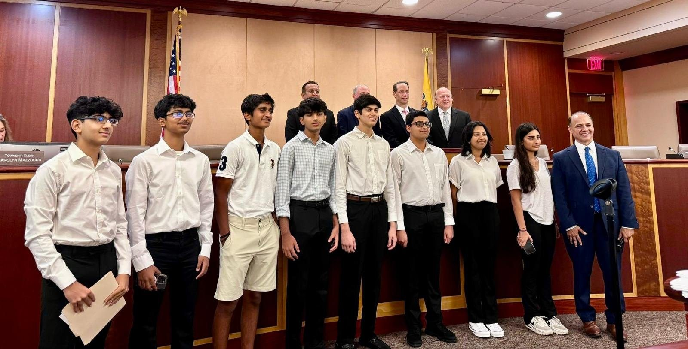

# Livingston Youth Leaders — new website

A plain HTML/CSS site. No WordPress, no build step, no plugins. Open `index.html`
in any browser to see it right now.

```
index.html         Home
our-story.html     Our Story + board bios
projects.html      All projects, filterable by year
get-involved.html  Ways to help, contact form, FAQs
styles.css         All styling (one file)
script.js          Mobile menu, year filters, contact form
images/            Drop your photos here — see images/README-PHOTOS.txt
```

## 1. Adding your photos

Every photo slot currently shows a striped placeholder that names the file it wants.
To fill one, open the HTML file, find the placeholder, and swap the two lines.

**Before:**

```html
<!--  -->
<div class="ph">PHOTO: hero.jpg<br>Group shot at an event</div>
```

**After** — delete the `<div class="ph">` line and uncomment the image:

```html

```

That's the whole process, repeated for each photo. The correct filenames are already
written into each placeholder and listed in `images/README-PHOTOS.txt`.

Sizes: project and event photos look best at 1200×800 (landscape), board headshots
at 800×800 (square). Save as JPG under ~400 KB each.

## 2. The logo

Done — a full logo set lives in `brand/`, already wired into every page (header, footer,
and browser tab icon). Three concepts are included; the site uses **sun-badge** by default.

See `brand/BRAND-GUIDE.md` for the palette, all the file formats, which one to use where,
and how to switch concepts.

## 3. Adding a new project

Copy any `<article class="card" data-year="...">` block in `projects.html` and edit it.
Set `data-year` to the correct year so the filter buttons pick it up. If it's a new
year, add a button to the `.filters` row:

```html
<button class="filter" data-filter="2027">2027</button>
```

## 4. Changing the colors

The site uses the **Periwinkle & Rose** palette. Everything is driven by the variables at
the top of `styles.css`:

```css
:root {
  --teal-900: #434F9B;   /* indigo — hero, footer, dark sections */
  --teal-700: #5A6BC4;   /* deep periwinkle — links */
  --teal-500: #7F8FDE;   /* periwinkle — accents */
  --coral-500: #E27055;  /* coral rose — buttons, tags */
  --sand:      #FFFBF8;  /* cream — section backgrounds */
}
```

Change those five and the whole site follows. (The variable names still say *teal* and
*coral* from the first draft — they're just labels now, the values are what matter.)

## 5. Making the contact form actually send email

Right now the form opens the visitor's email app with everything pre-filled. That works
everywhere and costs nothing, but some people don't have a mail app configured.

To collect submissions directly instead, sign up at [formspree.io](https://formspree.io)
(free tier is plenty), then in `get-involved.html` change:

```html
<form class="form" id="contact-form">
```

to:

```html
<form class="form" action="https://formspree.io/f/YOUR_FORM_ID" method="POST">
```

Removing `id="contact-form"` disables the mailto handoff and lets Formspree take over.

## 6. Putting it online

**Netlify (easiest):** go to [app.netlify.com/drop](https://app.netlify.com/drop) and drag
the whole `lyl-site` folder onto the page. It's live in seconds, free, with HTTPS.

**GitHub Pages:** create a repo, upload these files, then Settings → Pages → deploy from
the `main` branch root.

**Keeping leadforfuture.org:** whichever host you pick, add `leadforfuture.org` as a custom
domain in its settings, then update the DNS records at your domain registrar to point there.
Do this only once you're happy with the new site — it replaces what's live today.

## Notes on the content

- The old site's header showed a South Orange address, a `973-762-4720` phone number, and an
  `NJimmigration.com` email — leftover from the WordPress template. All removed.
- Fundraising totals, project descriptions, and board bios were carried over from the old
  site and rewritten. **Please double-check the dollar figures** before publishing —
  the old site said "$24,000+ as of mid-2024" in one place and "$30,000+ over four years"
  in another. I used $30,000+ as the headline number.
- The 2022 School Supplies Drive was listed under 2023 on the old site but dated August 2022
  in the project archive. I placed it in 2022. Correct me if that's wrong.
- Project counts used in the stats: 13 projects, 325+ screenings, 22 seniors. All derived
  from the old site's own text.
